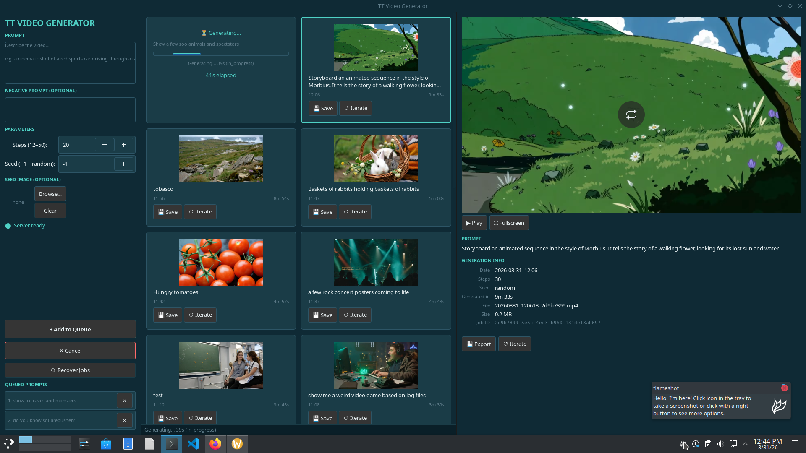

# tt-local-generator

A GTK4 desktop UI for generating videos with [Wan2.2-T2V-A14B-Diffusers](https://huggingface.co/Wan-AI/Wan2.2-T2V-A14B-Diffusers) via a local [tt-inference-server](https://github.com/tenstorrent/tt-inference-server) instance running on Tenstorrent hardware.



## Features

- **Prompt queue** — write multiple prompts while one is generating; they run automatically in sequence
- **Inline video player** — preview generated clips directly in the gallery card
- **Full-size player** — open any video in a maximized window (F for fullscreen, Space to play/pause, Esc to close)
- **Generation history** — all outputs saved to `~/.local/share/tt-video-gen/` with metadata sidecars
- **Iterate** — re-populate the prompt panel from any past generation to refine it
- **Job recovery** — re-attach to server jobs that survived a UI crash
- **Seed image** — attach a reference image to bias the visual style

## Quick start

```bash
# 1. One-shot setup (Ubuntu 24.04)
git clone https://github.com/tsingletaryTT/tt-local-generator.git ~/code/tt-local-generator
cd ~/code/tt-local-generator
./setup_ubuntu.sh

# 2. Start the inference server (requires tt-inference-server configured)
./start_wan.sh
# Wait ~5 min for: "Application startup complete"

# 3. Launch the UI (in a second terminal)
/usr/bin/python3 main.py
```

See **[GUIDE.md](GUIDE.md)** for the full walkthrough: server setup, API tour, troubleshooting, chaining clips, prompt generation, and configuration reference.

## Requirements

- Ubuntu 22.04+ (24.04 recommended)
- Tenstorrent accelerator (P150x4 tested; see GUIDE.md §9 for fewer chips)
- [tt-inference-server](https://github.com/tenstorrent/tt-inference-server) running locally
- System `python3` with `python3-gi` (GTK4 bindings — **not pip-installable**, must be system packages)
- `ffmpeg`, GStreamer (`libgtk-4-media-gstreamer`, `gstreamer1.0-libav`)

## Architecture

| File | Purpose |
|---|---|
| `main.py` | `Gtk.Application` entry point |
| `main_window.py` | All GTK4 widgets (`MainWindow`, `GenerationCard`, `GalleryWidget`, `ControlPanel`, `VideoPlayerWindow`) |
| `worker.py` | `GenerationWorker` — pure Python, no GUI imports |
| `api_client.py` | HTTP client for the inference server |
| `history_store.py` | Persistent JSON history + file path management |
| `start_wan.sh` | Launch script for the Wan2.2 inference server |
| `setup_ubuntu.sh` | One-shot Ubuntu 24.04 dependency installer |

## License

Apache 2.0
